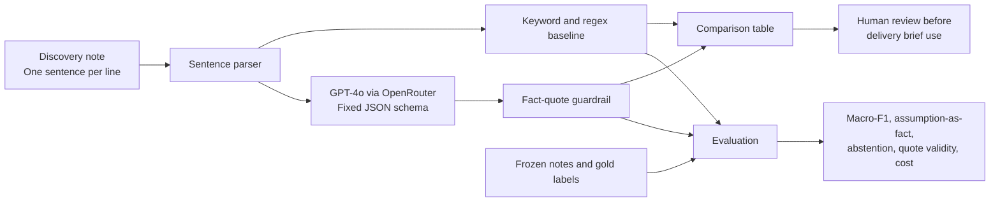

# NoteTriage Product Documentation

## User and problem

**Primary user:** Mei, a first-year implementation associate at a B2B IT services firm. After a discovery call, she must prepare a business-understanding brief before the delivery team starts planning.

**Problem:** Unverified guesses can be copied into a delivery brief as though the client had confirmed them. A mistaken fact about an API, access method, dataset, policy, or deadline can waste a delivery sprint.

## Input and output

**Input:** A discovery note pasted as one sentence per line. The system handles no real client data in this course project.

**Output:** Each sentence is labelled `fact`, `assumption`, `open_question`, or `abstain`. Every `fact` must include a verbatim quote from the input sentence. A fact lacking a valid quote is automatically downgraded to `abstain`.

## Architecture

## Design choices

- **Foundation model:** The task requires classifying varied, previously unseen phrasing. A fixed JSON schema constrains model output.
- **No RAG in version 1:** Each evaluation item is a single note, not a question over a document corpus.
- **No agent:** The task requires one classification pass, not a multi-step tool loop.
- **Rules remain useful:** The keyword/regex baseline provides a transparent comparison and a conservative fallback.
- **Human approval remains mandatory:** This is assistive triage, not an autonomous commitment system.

## Metrics

Primary safety metric:

`assumption-as-fact rate = gold assumptions predicted as fact / all gold assumptions`

The pre-registered target was below 10%. The final manually labelled holdout contains 15 notes and 113 sentences: 43 facts, 29 assumptions, and 41 open questions.

| System | Assumption-as-fact | Macro-F1 | Abstention | Fact quote validity |
|---|---:|---:|---:|---:|
| Keyword/regex baseline | 0/29 (0.0%) | 0.311 | 77.0% | 100% |
| GPT-4o (`openai/gpt-4o-2024-08-06`) | 3/29 (10.3%) | 0.843 | 0.0% | 100% |

GPT-4o improved coverage and overall classification substantially, but missed the safety target by one error. The baseline met the safety target only by abstaining on most inputs. This is the central trade-off of the project, not a result to hide.

## Cost and limitations

The GPT-4o evaluation used 4,120 input tokens and 3,786 output tokens. The recorded estimate is USD 0.04816 for the 15-note batch, approximately USD 0.00321 per note. Total batch latency was 19.34 seconds.

The data is fictional and small. The gold labels were manually authored; some scenario themes were inspired by early development examples, which limits topical independence. The project does not establish performance on live client data. It also does not demonstrate whether a second annotator would agree with every gold label. Future work should use independently authored, privacy-safe notes, a second blind annotator, and a human-review interface.
